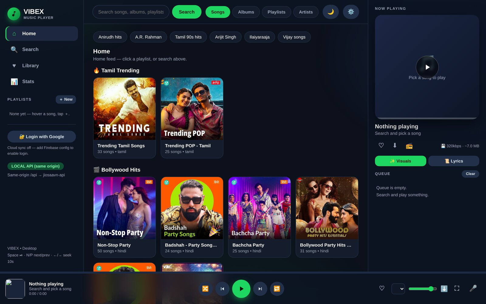
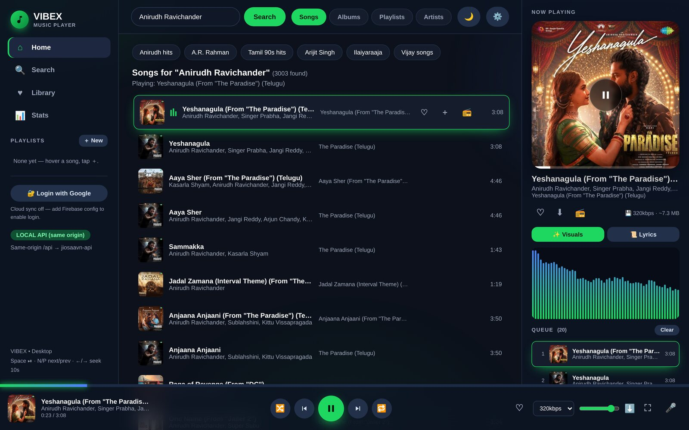
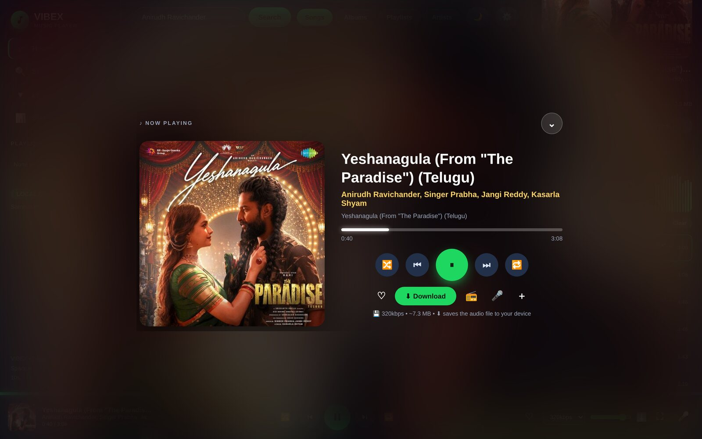
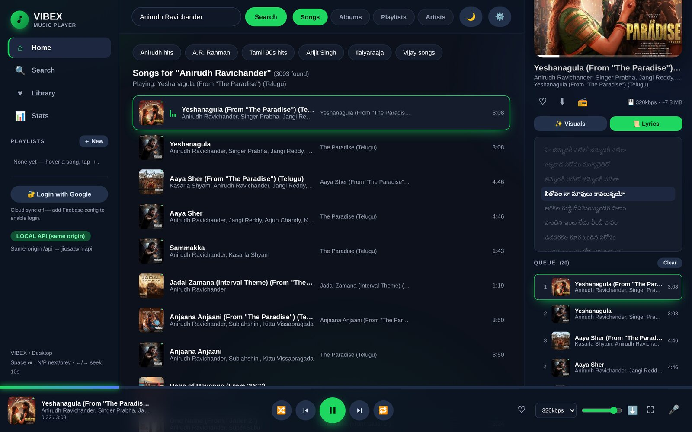
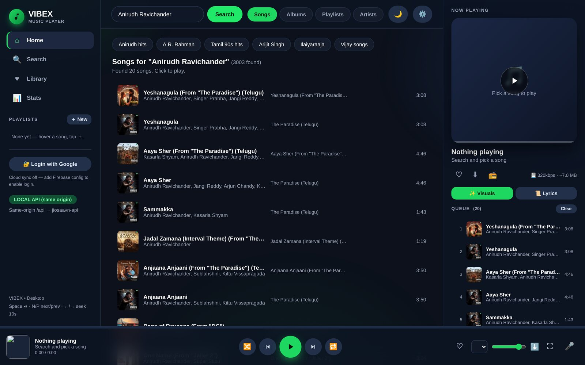
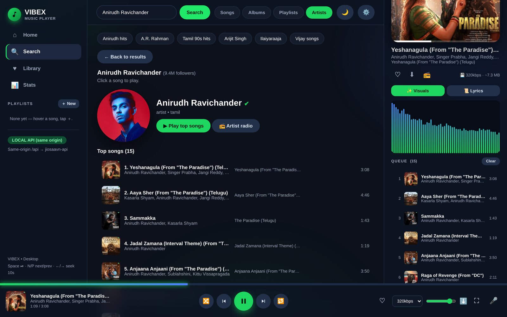
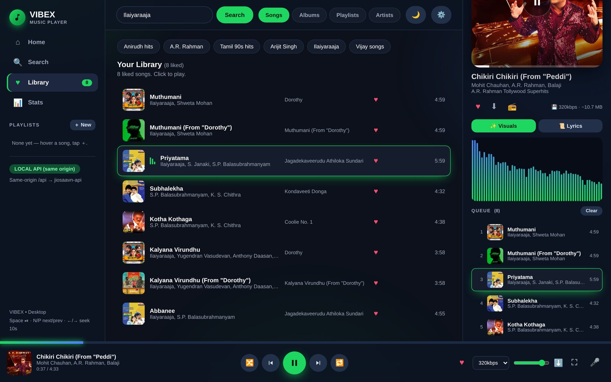
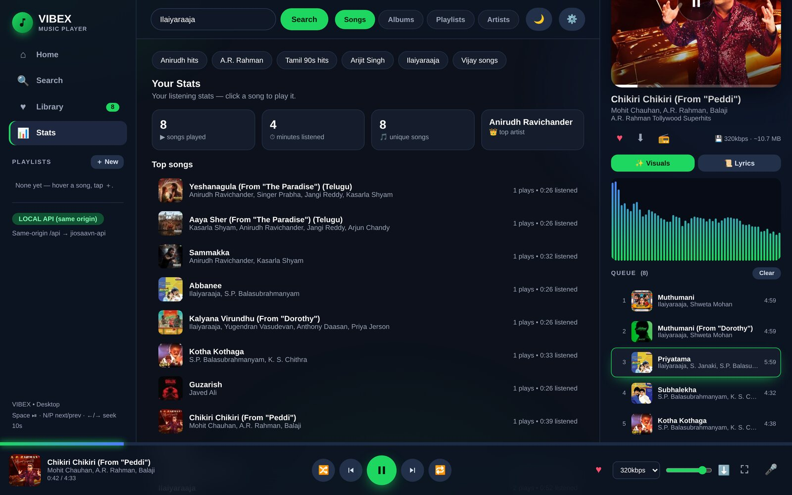
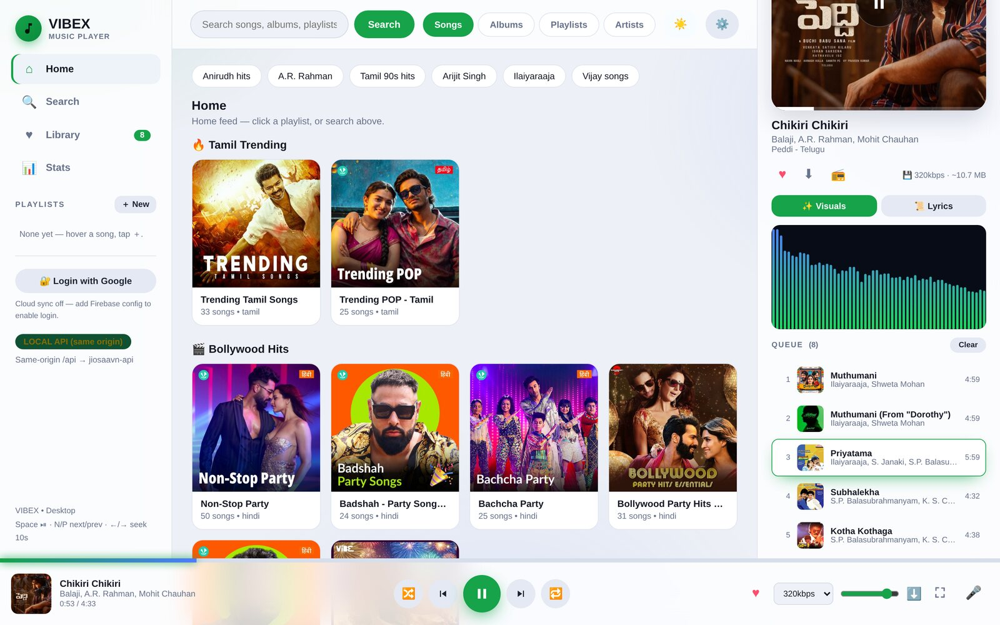

<div align="center">

# 🎵 VIBEX

**A mobile-first, Echo-inspired VIBEX player with a React/Capacitor UI and native Android playback.**


[✨ Features](#-features) · [🚀 Quick Start](#-quick-start) · [📸 Screenshots](#-screenshots) · [⚖️ Legal](#legal)

</div>

> **Latest testing update:** [Vibex 2.0-test5](docs/TEST5.md) fixes the missing Android notification player by registering the directly started media session with Media3. A regression reproduces the old zero-session failure; notification/foreground/control checks pass in API 28 and 33 Robolectric simulations. Install over test4 without uninstalling. Fixed header, direct return, library, name, icon, and signing identity remain unchanged.
>
> **Testing APK + AI icon:** The current test build uses the same `dev.viswesh.vibex.testing` package and signing key as earlier tests. [Test4 notes](docs/TEST4.md), [test3 notes](docs/TEST3.md), [test2 notes](docs/TEST2.md), and [test1 notes](docs/TEST_APK.md) are historical references.
>
> **Android-first v2 implementation:** See [architecture, scope and build instructions](docs/ANDROID_V2.md), [verification results](docs/VERIFICATION.md), and the [open device acceptance checklist](docs/DEVICE_QA.md).
> Native Media3 playback, managed downloads, SQLite/backup, local audio, EQ and a widget are implemented locally. Builds and automated checks pass; real-device acceptance is still required. The remaining README describes the original gateway/catalog/export architecture; use the v2 guide for current UI and playback boundaries.
>
> UI screenshots: [mobile](docs/screenshots/mobile.png) · [desktop](docs/screenshots/desktop.png).


> ### ⚖️ Legal notice — please read
>
> VIBEX is an **independent, open-source, non-commercial** project. It is **not**
> affiliated with, endorsed by, or sponsored by **JioSaavn**, Reliance
> Industries, or any record label or streaming service.
>
> This repository **hosts no music**. It contains no audio files, no album
> artwork, and no lyrics. It is a user interface that resolves playback URLs
> on demand through a third-party API and streams them directly from that
> service's own CDN to your browser.
>
> All music, artwork, metadata, and lyrics remain the property of their
> respective **artists, labels, publishers, and rights holders**.
>
> Intended for **personal, private, educational use only**.
> Full terms: [⚖️ Legal & Copyright](#legal) ·
> [Third-party notices](NOTICE.md) · [DMCA / takedowns](DMCA.md)

---

## ✨ Features

| | |
|---|---|
| 🔍 **Deep search** | Songs, albums, playlists & artists with a trending home feed |
| ▶️ **Full player** | Shuffle, repeat, sleep timer, crossfade, queue manager, live spectrum visualizer |
| 🖥️ **Full-screen mode** | Spotify-style immersive view — click any song title to enter |
| 📜 **Synced lyrics** | Karaoke-style line highlighting via the 🎤 mic button |
| ⬇️ **One-click downloads** | Real audio files with correct names, served by a smart retrying backend |
| 🎤 **Artist pages** | Top songs, albums, follower counts, artist radio stations |
| 📻 **Endless radio** | Auto-extending stations seeded from any song |
| 🎵 **Custom playlists** | Create, rename, reorder — saved on your device |
| 📊 **Listening stats** | Plays, minutes, top songs & artists |
| 🌗 **Dark / light** | Premium glass UI with a Data Saver mode for slow networks |

## 🚀 Quick Start

**Requirements:** Node 20+, [Bun](https://bun.sh) (one command installs it below).

```bash
# 1. install everything
bash setup.sh

# 2. start the music API (terminal 1)
cd jiosaavn-api && PORT=3001 bun run run-local.mjs

# 3. build the front-end and start the VIBEX gateway (terminal 2)
cd music-app && npm install && npm start
```

`npm start` runs the Vite build and then the gateway. During UI work,
`npm run dev` gives you Vite's dev server with hot reload; it proxies `/api`
and `/dl` to the gateway, so keep that running too.

Open **http://localhost:8000** and press play. 🎧

## 📸 Screenshots

Real captures from a local run against the bundled API.

<p align="center">
  
  <br/><sub><b>Home</b> — trending feed, pulled live</sub>
</p>

<table>
  <tr>
    <td width="50%"></td>
    <td width="50%"></td>
  </tr>
  <tr>
    <td><sub><b>Now playing</b> — live spectrum visualizer, queue, 320 kbps download</sub></td>
    <td><sub><b>Full-screen</b> — immersive view, click any song title to enter</sub></td>
  </tr>
  <tr>
    <td></td>
    <td></td>
  </tr>
  <tr>
    <td><sub><b>Synced lyrics</b> — karaoke-style line highlighting via LRCLIB</sub></td>
    <td><sub><b>Search</b> — songs, albums, playlists &amp; artists</sub></td>
  </tr>
  <tr>
    <td></td>
    <td></td>
  </tr>
  <tr>
    <td><sub><b>Artist</b> — follower counts, top songs, artist radio</sub></td>
    <td><sub><b>Library</b> — everything you've hearted, stored on device</sub></td>
  </tr>
  <tr>
    <td></td>
    <td></td>
  </tr>
  <tr>
    <td><sub><b>Stats</b> — plays, minutes listened, top songs &amp; artists</sub></td>
    <td><sub><b>Light theme</b> — one-click toggle, same glass UI</sub></td>
  </tr>
</table>

## 📁 Project Structure

```
VIBEX/
├── music-app/
│   ├── src/
│   │   ├── components/ # UI components (sidebar, player bar, views, overlays)
│   │   ├── state/      # React contexts: settings, library, player, UI, status
│   │   ├── hooks/      # visualizer, lyrics sync, sleep timer, shortcuts
│   │   ├── lib/        # api client, formatters, song helpers, LRC parser
│   │   └── styles/     # global stylesheet
│   ├── index.html      # Vite entry shell
│   ├── tagger.mjs      # zero-dependency ID3v2.3 / MP4 tag writer
│   └── server.mjs      # gateway: serves the build, proxies /api, /dl downloads
├── jiosaavn-api/       # music metadata + stream backend (Bun + Hono)
│   └── run-local.mjs   # local runner (port 3001)
├── docs/screenshots/   # README product screenshots
└── setup.sh            # local dependency installer
```

## 🛠️ Tech Stack

- **Frontend:** React 18 + Vite — component-based, built to static assets
- **Gateway:** Node.js (static + `/api` proxy + `/dl` download server)
- **Music API:** Bun + Hono + JavaScript (JioSaavn wrapper)
- **Lyrics:** [LRCLIB](https://lrclib.net) (synced, keyless)
- **Runtime:** local Node.js gateway + Bun API (no deployment configuration included)

<a id="legal"></a>

## ⚖️ Legal & Copyright — Read Before Running

This section exists so that rights holders and users know exactly what this
project is. Please read it before you run or fork it.

### 1. What this project is — and what it is not

| ✅ VIBEX **is** | ❌ VIBEX **is not** |
|---|---|
| An open-source front-end + gateway, MIT-licensed | A music service, store, or label |
| A personal-use tool for your own listening | A commercial or monetised product |
| Independent and unaffiliated with JioSaavn | Official, endorsed, or licensed by anyone |

### 2. This repository hosts **no** copyrighted media

The repository contains **source code only**. It does not:

- store, bundle, or ship any audio file;
- store, bundle, or ship any album artwork, artist photo, or lyric text;
- maintain any index, catalogue, or database of media;
- run any server that persists media to disk.

Playback URLs are resolved **on demand, at the moment of playback**, from a
third-party API, and the audio is streamed **directly from JioSaavn's own CDN**
to your browser. Nothing is copied onto a VIBEX server at any point.

### 3. Trademarks and rights holders

- **JioSaavn®** and the JioSaavn logo are trademarks of their respective
  owners. Used here for **nominative, descriptive purposes only** — to say
  which service the metadata comes from.
- All **songs, compositions, master recordings, album artwork, artist
  imagery, and lyrics** are the exclusive property of their respective record
  labels, artists, publishers, photographers, and other rights holders.
- No affiliation, endorsement, or sponsorship by any of the above is claimed
  or implied.

### 4. Third-party code and attribution

VIBEX stands on other people's work, and they get full credit:

| Component | License | Owner |
|---|---|---|
| `jiosaavn-api/` (vendored fork) | MIT | **Sumit Kolhe** — [upstream](https://github.com/sumitkolhe/jiosaavn-api) |
| Hono, Zod, Scalar | MIT | respective authors |
| `node-forge` | BSD-3-Clause | Digital Bazaar, Inc. |
| Lyrics | — | **LRCLIB**, credited on-screen |

Full details, including what was modified in the vendored fork, are in
**[NOTICE.md](NOTICE.md)**. The upstream MIT license is preserved unmodified at
[`jiosaavn-api/LICENSE`](jiosaavn-api/LICENSE).

### 5. Your responsibility when you run this locally

By running your own instance, **you** accept that:

1. **You are responsible for your own compliance** with the copyright law of
   your jurisdiction and with JioSaavn's Terms of Service.
2. **Personal, private use only.** Do not monetise it, do not put ads on it,
   do not sell access, and do not redistribute downloaded audio.
3. **Do not remove these notices.** If you fork this project, keep this
   section, `NOTICE.md`, `DMCA.md`, and the upstream license intact.
4. **The upstream API is unofficial** and may change, break, or be shut down
   at any time, without notice and without liability to anyone.
5. **Downloading** copies a temporary file to your own device for your own
   offline listening. Redistribution of those files is your action and your
   liability — not this project's.

### 6. DMCA and takedown requests

If you are a copyright owner and believe something here infringes your rights,
**maintainers will respond — this project has no interest in hosting anything
infringing.**

📩 Open a [GitHub issue](https://github.com/Viswesh28/VIBEX/issues) or contact
the maintainer via their GitHub profile.

Valid notices are acknowledged **within 72 hours**. Full procedure, required
elements under 17 U.S.C. § 512(c)(3), and counter-notification steps are in
**[DMCA.md](DMCA.md)**.

### 7. Plain-spoken limitation of all the above

**Disclaimers do not create legal protection.** No notice in this file makes
the unlicensed streaming or downloading of copyrighted music lawful, and none
of it guarantees immunity from a takedown, a strike, or a claim. What these
notices genuinely do is (a) give required attribution to the upstream authors,
(b) make clear that no media is hosted here, and (c) give rights holders a
fast, working path to removal.

Nothing in this repository is legal advice. For your own use, consult a
lawyer in your jurisdiction — or, better, use a licensed streaming service.

**Support the artists. 💚 Stream officially, buy the music, go to the shows.**

---

## 📄 License

The **source code** of VIBEX is released under the **MIT License** — see
[LICENSE](LICENSE).

That license covers the code only. It grants **no rights whatsoever** to any
music, artwork, lyrics, or trademark — which remain the property of their
respective owners. See [LICENSE](LICENSE) ("Scope of this License"),
[NOTICE.md](NOTICE.md), and [DMCA.md](DMCA.md).
